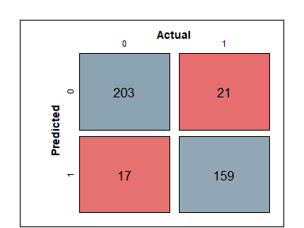

# Naive Bayes classification

# 1 Introduction

Company X is expanding and wants to hire more data scientist to fill
their open positions, Company X has data about potential individuals in
the data science field, and wants to know which individuals are more
likely to come work for them. In this way they can reach out to
potential candidates in advance before other companies do. Therefore,
this analysis addresses the following: *How can potential data science
job candidates be predicted using the naïve Bayes classifier?*

# 2 Data

The data contains the decisions of 2,000 employees in addition to ten
variables that describe them. The variable of interest is *target* which
indicates whether the employee switched jobs or did not. For this
analysis, three transformations are performed on the data. First, the
variable indicating the city development index is cutoff according to
its quartiles in the training set. Second, the variable indicating the
total number of years of experience is split into 5 categories, 0-2,
3-5, 6-10, 11-20, and 21+ years. Lastly, the variable indicating the
number of training hours is transformed to its natural logarithm for a
more Gaussian distribution.

# 3 Methodology

To predict whether a data scientist is likely to come work for the new
company, a naïve Bayes model is constructed. The data is randomly
divided into a training (80%) and test (20%) set to construct and
evaluate the model.

Naïve Bayes is a classification algorithm based on the Bayes’ theorem.
We want to classify an observation into one of *K* classes, in our case,
*K* = 2. Let *f**k*(*x*) ≡ Pr (*X*∣*Y*=*k*) represents the
density function of *X* for an observation that comes from the *k*th
class. The theorem states that

where Pr(*Y*=*k*∣*X*=*x*) is the posterior probability that an
observation *X* = *x* belongs to the *k*th class, *π**k* is
the overall prior probability that a randomly selected observation comes
from the *k*th class, and *l* = 1, 2, …, *K* (James et al. 2013). Naïve
Bayes assumes that within the *k*th class, the *p* predictors are
independent. This means that

where *j* = 1, 2, …, *p*, *k* = 1, 2, …, *K*, and *p* = 10. By
substituting equation (2) in (1), the final formula for posterior
probability can then be obtained:

The posterior probability can then be used to classify the observations.
To avoid zero probability in our model, Laplace smoothing parameter *α*
is set to 1. Also, 10-fold cross validation is performed to construct
the model.

# 4 Results

Figure 1: Confusion matrix test set

Figure @ref(fig:cm) shows the confusion matrix together with a few
evaluation metrics after running the model on the test data. The
sensitivity of the model is 0.883, which indicates that 88.3% of the
people that switched jobs are correctly identified. The specificity of
the model is 0.923, which indicates that 92.3% of the people that did
not leave their job are correctly identified. The overall accuracy of
the model is 90.5%.[1] The value of Cohen’s Kappa is 0.808, which
indicates how well the model performed as compared to how well it would
have performed simply by chance, a value greater than 0.75 indicates
excellent agreement beyond chance (Landis and Koch 1977). All evaluated
metrics suggests that the naïve Bayes model is able to classify
potential data science job candidates with good accuracy.

# 5 Conclusion

In this analysis, potential data science jobs candidates are predicted
using a naïve Bayes model. The sensitivity, specificity, and accuracy of
the produced model are 88.3%, 92.3%, and 90.5%, respectively. Overall,
the results according to the evaluation metrics suggest that the model
is capable to predict potential job candidates with good accuracy.

# 6 References

James, Gareth, Daniela Witten, Trevor Hastie, and Robert Tibshirani.
2013. *An Introduction to Statistical Learning*. Vol. 112. Springer.

Landis, J Richard, and Gary G Koch. 1977. “An Application of
Hierarchical Kappa-Type Statistics in the Assessment of Majority
Agreement Among Multiple Observers.” *Biometrics*, 363–74.

[1] The same result is obtained using kernel density estimate instead of
log transforming the continuous variable.
